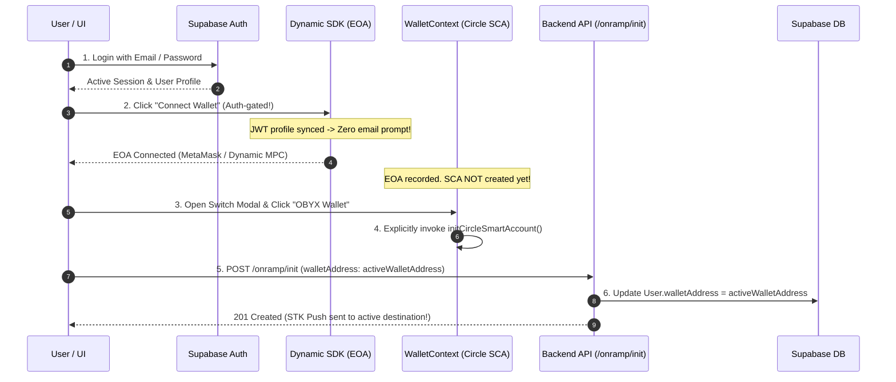

# Architecture Specification 01: Onramp Pipeline, Auth-Gated Wallet Provisioning & Seamless Dynamic UX

**Document ID**: `ARCH-SPEC-01`  
**Status**: Approved for Engineering Implementation  
**Target Subsystems**: Frontend Wallet Providers, UI Widgets, and Backend Onramp API Routing  
**Primary Objective**: Eliminate onboarding UX friction, enforce strict Supabase authentication prior to wallet connection, implement explicit (lazy) Circle Smart Account (SCA) provisioning, and guarantee dynamic backend address resolution during Onramp STK push disbursements.

---

## 1. Executive Summary & Architectural Motivation

### 1.1 Problem Statement
The current platform implementation exhibits four core architectural discrepancies:
1. **Redundant Onboarding Friction**: Users register via Supabase (Email/Password), yet upon initiating wallet connection, the Dynamic SDK prompts them for an email verification again.
2. **Unauthenticated Wallet Connectivity**: Unauthenticated site visitors can invoke wallet connection flows and generate external or embedded wallets without an active Supabase user session.
3. **Eager SCA Provisioning**: `WalletContext` automatically initializes a Circle Smart Account (SCA) on Base Sepolia immediately upon EOA connection, deploying counterfactual addresses before the user requests an embedded wallet.
4. **Static Address Resolution**: During Onramp initiation, the backend defaults to static database values (`user.walletAddress`) unless explicitly overridden. If an EOA address is stored in the database while the user is actively viewing an embedded Smart Account in the UI, disbursed funds land in the EOA while the active UI reports a `0.00` balance.

### 1.2 Target Architecture

