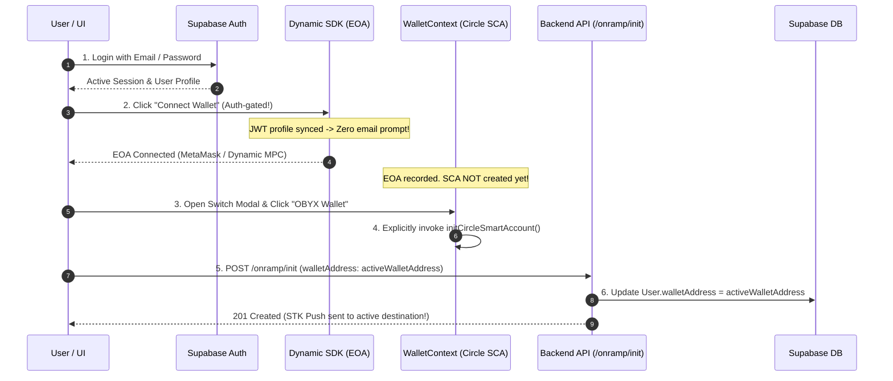

# Architecture Specification 01: Onramp Pipeline, Auth-Gated Wallet Provisioning & Seamless Dynamic UX

**Document ID**: `ARCH-SPEC-01`  
**Status**: Approved for Engineering Implementation  
**Target Subsystems**: Frontend Wallet Providers, UI Widgets, and Backend Onramp API Routing  
**Primary Objective**: Eliminate onboarding UX friction, enforce strict Supabase authentication prior to wallet connection, implement explicit (lazy) Circle Smart Account (SCA) provisioning, and guarantee dynamic backend address resolution during Onramp STK push disbursements.

---

## 1. Executive Summary & Architectural Motivation

### 1.1 Problem Statement
The current platform implementation exhibits four core architectural discrepancies:
1. **Redundant Onboarding Friction**: Users register via Supabase (Email/Password), yet upon initiating wallet connection, the Dynamic SDK prompts them for an email verification again.
2. **Unauthenticated Wallet Connectivity**: Unauthenticated site visitors can invoke wallet connection flows and generate external or embedded wallets without an active Supabase user session.
3. **Eager SCA Provisioning**: `WalletContext` automatically initializes a Circle Smart Account (SCA) on Base Sepolia immediately upon EOA connection, deploying counterfactual addresses before the user requests an embedded wallet.
4. **Static Address Resolution**: During Onramp initiation, the backend defaults to static database values (`user.walletAddress`) unless explicitly overridden. If an EOA address is stored in the database while the user is actively viewing an embedded Smart Account in the UI, disbursed funds land in the EOA while the active UI reports a `0.00` balance.

### 1.2 Target Architecture


---

## 2. Technical Scope & Implementation Roadmap

The implementation is divided into four distinct engineering subsystems. These tasks may be executed sequentially or in parallel by the engineering team.

### Phase 1: Dynamic SDK UX & Auth Synchronization (Frontend)
* [ ] **Task 1.1: Supabase Profile Injection into Dynamic Provider**
  * *Target File*: `apps/web/components/providers/DynamicProviderWrapper.tsx`
  * *Specification*: Inject `useAuth()` user profile session data into `DynamicContextProvider` settings and set `initialAuthenticationMode: "connect-only"` to bypass redundant email prompts during external wallet onboarding.
* [ ] **Task 1.2: Enforce Auth-Gating on Dashboard Wallet Widget**
  * *Target File*: `apps/web/components/dashboard/WalletWidget.tsx`
  * *Specification*: Validate Supabase authentication state (`if (!user)`) prior to rendering the wallet connection modal, redirecting unauthenticated visitors to `/auth/signup`.
* [ ] **Task 1.3: Enforce Auth-Gating on Swap Initiation Actions**
  * *Target File*: `apps/web/components/home/SwapWidget.tsx`
  * *Specification*: Add authentication verification to conversion action buttons to ensure users cannot attempt conversion flows without an active Supabase session.

### Phase 2: Explicit Lazy Circle SCA Provisioning (Frontend)
* [ ] **Task 2.1: Remove Eager SCA Auto-Initialization**
  * *Target File*: `apps/web/lib/WalletContext.tsx`
  * *Specification*: Remove the automatic `initCircleSmartAccount()` invocation from the primary EOA connection `useEffect` hook.
* [ ] **Task 2.2: Create Standalone SCA Provisioning Handler**
  * *Target File*: `apps/web/lib/WalletContext.tsx`
  * *Specification*: Implement an explicit `provisionObyxWallet()` method within the context and expose it through the public interface.
* [ ] **Task 2.3: Wire UI Selection to Explicit SCA Provisioning**
  * *Target File*: `apps/web/components/dashboard/WalletWidget.tsx`
  * *Specification*: Update the wallet switch popover such that selecting "OBYX Wallet" triggers `provisionObyxWallet()` if an embedded address has not yet been provisioned.

### Phase 3: Active Wallet Synchronization (Frontend $\rightarrow$ Backend)
* [ ] **Task 3.1: Synchronize Database Record on Active Wallet Switch**
  * *Target File*: `apps/web/components/dashboard/WalletWidget.tsx`
  * *Specification*: Invoke `UserService.postUserLinkWallet` whenever `setActiveWallet` toggles between external EOA and embedded SCA.
* [ ] **Task 3.2: Explicit Address Payload in Onramp Initiation**
  * *Target File*: `apps/web/components/home/SwapWidget.tsx`
  * *Specification*: Enforce that `OnrampService.postOnrampInit` payloads strictly include `walletAddress: activeWalletAddress` from context.

### Phase 4: Backend Address Resolution & DB Synchronization (Backend)
* [ ] **Task 4.1: Prioritize Requested Destination in Onramp Handler**
  * *Target File*: `apps/api/routes/onramp.routes.js`
  * *Action*: Refactor `/onramp/init` to prioritize `req.body.walletAddress` and update `user.walletAddress` in the database dynamically to ensure subsequent webhooks disburse correctly.
* [ ] **Task 4.2: Strict EVM Address Format Validation**
  * *Target File*: `apps/api/routes/onramp.routes.js`
  * *Action*: Implement strict regex validation (`^0x[a-fA-F0-9]{40}$`) on the resolved destination wallet before initiating the Paystack STK push.

---

## 3. Reference Implementation & Exact Code Modifications

### 3.1 `apps/web/components/providers/DynamicProviderWrapper.tsx`
**Engineering Goal**: Sync Supabase email profile with Dynamic SDK settings to bypass secondary email prompts.

```diff
  "use client";

  import { DynamicContextProvider } from "@dynamic-labs/sdk-react-core";
  import { EthereumWalletConnectors } from "@dynamic-labs/ethereum";
  import { WagmiProvider } from "wagmi";
  import { QueryClient, QueryClientProvider } from "@tanstack/react-query";
  import { wagmiConfig } from "@/lib/wagmi";
  import { WalletProvider } from "@/lib/WalletContext";
  import { TransactionHistoryProvider } from "@/lib/TransactionHistoryContext";
+ import { useAuth } from "@/lib/AuthContext";
  import type { ReactNode } from "react";

  const DYNAMIC_ENV_ID = (process.env.NEXT_PUBLIC_DYNAMIC_ENV_ID || "placeholder-env-id") as string;
  const queryClient = new QueryClient();

  export function DynamicProviderWrapper({ children }: { children: ReactNode }) {
+   const { user } = useAuth();
+
    return (
      <DynamicContextProvider
        settings={{
          environmentId: DYNAMIC_ENV_ID,
          walletConnectors: [EthereumWalletConnectors],
          walletConnectPreferredChains: ["eip155:84532"], // Base Sepolia chain ID
+         initialAuthenticationMode: "connect-only",
+         userProfile: user ? { email: user.email } : undefined,
        }}
      >
        <WagmiProvider config={wagmiConfig}>
          <QueryClientProvider client={queryClient}>
            <WalletProvider>
              <TransactionHistoryProvider>{children}</TransactionHistoryProvider>
            </WalletProvider>
          </QueryClientProvider>
        </WagmiProvider>
      </DynamicContextProvider>
    );
  }
```

---

### 3.2 `apps/web/components/dashboard/WalletWidget.tsx`
**Engineering Goal**: Restrict wallet connection to authenticated users and bind embedded wallet selection to lazy SCA provisioning.

```diff
  export function WalletWidget() {
    const {
      walletAddress,
      circleAddress,
      activeWallet,
      setActiveWallet,
+     provisionObyxWallet,
      isConnected,
      isInitializingCircle,
      circleError,
      disconnect,
    } = useWallet();

