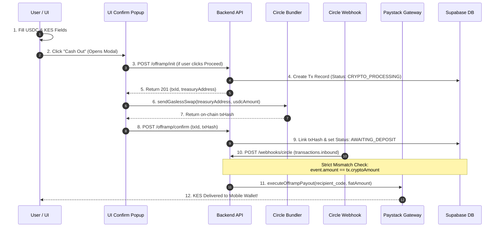

# Architecture Specification 02: End-to-End Offramp Pipeline & Edge Case Gating

**Document ID**: `ARCH-SPEC-02`  
**Status**: Approved for Engineering Implementation  
**Target Subsystems**: Frontend Swap Widget, Backend Offramp Routes, and Circle Inbound Webhook Routing  
**Primary Objective**: Restrict offramping to embedded OBYX wallets, implement pre-flight UI confirmation modals, expose the Treasury destination address via API, eliminate hardcoded mock timeouts, and implement automated strict-gated mobile money payouts via Circle inbound webhooks.

---

## 1. Executive Summary & Architectural Motivation

### 1.1 Problem Statement
The current offramp (USDC -> KES) implementation contains critical failure points:
1. **Frontend Self-Sending**: The frontend currently transfers USDC from the user's address back to the user's address, failing to deposit funds into the Obyx Treasury.
2. **Missing Treasury Destination**: The backend does not provide a destination address when initializing an offramp request.
3. **Hardcoded Mock Payout Delay**: The backend executes fiat payouts based on a 5-second `setTimeout` mock instead of verifying on-chain deposits.
4. **Ignored Inbound Webhooks**: The webhook listener ignores `transactions.inbound` events, preventing real blockchain reconciliation.

### 1.2 Target Architecture


---

## 2. Step-by-Step Implementation Plan

### Phase 1: Backend Offramp Initialization & Treasury Exposure
* [ ] **Task 1.1**: `feat(api): expose treasury wallet address in offramp init`
  * *File*: `apps/api/routes/offramp.routes.js`
  * *Action*: Inject `CIRCLE_TREASURY_ADDRESS` into the response payload for client routing.
* [ ] **Task 1.2**: `feat(api): strict numeric bounds validation`
  * *File*: `apps/api/routes/offramp.routes.js`
  * *Action*: Add validation to ensure `usdcAmount` is positive and correlates correctly with `fiatAmount`.

### Phase 2: Frontend OBYX-Wallet Gating & Confirm Modal
* [ ] **Task 2.1**: `feat(swap): restrict offramping to embedded obyx wallets`
  * *File*: `apps/web/components/home/SwapWidget.tsx`
  * *Action*: Add `activeWallet !== "embedded"` check to block EOA offramps and show guidance banner.
* [ ] **Task 2.2**: `feat(swap): implement pre-flight ui confirmation modal`
  * *File*: `apps/web/components/home/SwapWidget.tsx`
  * *Action*: Wrap offramp initiation in a confirmation modal to prevent orphaned database records.
* [ ] **Task 2.3**: `fix(swap): wire treasury address into gasless swap target`
  * *File*: `apps/web/components/home/SwapWidget.tsx`
  * *Action*: Pass the `treasuryAddress` obtained from `/offramp/init` to `sendGaslessSwap()`.

### Phase 3: Backend Confirmation & Mock Timer Removal
* [ ] **Task 3.1**: `refactor(api): eliminate 5-second mock timeout payout`
  * *File*: `apps/api/routes/offramp.routes.js`
  * *Action*: Remove the asynchronous mock timer from `/offramp/confirm` and update status to `AWAITING_DEPOSIT`.
* [ ] **Task 3.2**: `feat(api): create reusable payout execution service`
  * *File*: `apps/api/services/paystack.service.js`
  * *Action*: Implement `executeOfframpPayout()` to verify recipient creation and initiate M-Pesa transfer.

### Phase 4: Circle Inbound Webhook & Underpayment Gating
* [ ] **Task 4.1**: `feat(webhook): intercept circle inbound deposit events`
  * *File*: `apps/api/routes/webhook.routes.js`
  * *Action*: Add conditional routing to handle `transactions.inbound` events where `state === 'COMPLETE'`.
* [ ] **Task 4.2**: `feat(webhook): enforce strict deposit amount matching`
  * *File*: `apps/api/routes/webhook.routes.js`
  * *Action*: Verify webhook received amount exactly matches `transaction.cryptoAmount` before payout execution.

---

## 3. Reference Implementation & Code Modifications

### 3.1 `apps/api/routes/offramp.routes.js` (Initialization & Confirmation)
**Engineering Goal**: Return Treasury destination address on init, and remove mock timer on confirm.

```diff
  // POST /offramp/init handler
  router.post('/init', async (req, res) => {
    // ... existing validation & transaction creation ...

    return res.status(201).json({
      success: true,
      data: {
        transactionId: transaction.id,
        cryptoAmount,
        fiatAmount,
        exchangeRate: EXCHANGE_RATE,
        status: transaction.status,
+       treasuryAddress: process.env.CIRCLE_TREASURY_ADDRESS || "0xYourTreasuryWalletAddress",
      },
    });
  });

  // POST /offramp/confirm handler
  router.post('/confirm', async (req, res) => {
    const { transactionId, txHash } = req.body;
    const transaction = await Transaction.findByPk(transactionId);

    if (!transaction) return res.status(404).json({ error: 'Transaction not found' });

-   // REMOVED 5-SECOND MOCK SETTIMEOUT PAYOUT LOGIC
-   setTimeout(async () => { ... }, 5000);

+   // Bind on-chain transaction hash and wait for Circle inbound webhook
+   await transaction.update({
+     txHash: txHash,
+     status: 'AWAITING_DEPOSIT',
+   });
+
+   console.log(`[OFFRAMP] Transaction ${transactionId} awaiting deposit confirmation. txHash: ${txHash}`);
+
+   return res.status(200).json({
+     success: true,
+     message: 'Transaction confirmed on-chain. Awaiting Treasury receipt.',
+     data: { status: 'AWAITING_DEPOSIT' },
+   });
  });
```

---

### 3.2 `apps/web/components/home/SwapWidget.tsx` (Frontend Destination Fix)
**Engineering Goal**: Direct USDC to returned Treasury address via OBYX wallet only.

```diff
+ // 1. Restrict to Embedded OBYX Wallet
+ if (activeWallet !== "embedded") {
+   return (
+     <div className="rounded-xl border border-amber-500/30 bg-amber-500/10 p-4 text-center">
+       <p className="text-sm font-medium text-amber-200">
+         ⚡ Gasless Offramping Requires OBYX Wallet
+       </p>
+       <p className="mt-1 text-xs text-amber-300/80">
+         To enjoy 100% zero-gas transfers to M-Pesa, switch to your OBYX Wallet in the dashboard!
+       </p>
+       <button onClick={() => setShowSwitchModal(true)} className="mt-3 text-sm font-bold">
+         Switch to OBYX Wallet
+       </button>
+     </div>
+   );
+ }

  // 2. Inside Modal Proceed Handler
  const res = await OfframpService.postOfframpInit({ usdcAmount: usdcAmt });
+ const treasuryAddr = res.data!.treasuryAddress as string;
+ const txId = res.data!.transactionId;

- // OLD: const gaslessResult = await sendGaslessSwap(circleAddress, usdcAmt);
+ const gaslessResult = await sendGaslessSwap(treasuryAddr, usdcAmt);

+ // Notify backend of blockchain submission
+ await OfframpService.postOfframpConfirm({
+   transactionId: txId,
+   txHash: gaslessResult.txHash,
+ });
```

---

### 3.3 `apps/api/routes/webhook.routes.js` (Inbound Deposit Handler)
**Engineering Goal**: Listen for Circle Treasury deposit confirmations to execute mobile money payouts with strict verification gates.

```diff
  router.post('/circle', async (req, res) => {
    res.status(200).send('OK'); // Acknowledge immediately

    try {
      const event = req.body;
      
      // Existing outbound handler...
      if (event.notificationType === 'transactions.outbound') { ... }

+     // ── Inbound Treasury Deposit Handler ──
+     if (event.notificationType === 'transactions.inbound' && event.transaction?.state === 'COMPLETE') {
+       const txHash = event.transaction.txHash;
+       const receivedAmount = parseFloat(event.transaction.amounts[0]);
+       const destination = event.transaction.destinationAddress?.toLowerCase();
+
+       const tx = await Transaction.findOne({ where: { txHash: txHash, status: 'AWAITING_DEPOSIT' } });
+       if (!tx) return;
+
+       // Strict Destination Verification
+       if (destination !== process.env.CIRCLE_TREASURY_ADDRESS?.toLowerCase()) {
+         await tx.update({ status: 'FAILED_WRONG_DESTINATION' });
+         return;
+       }
+
+       // Strict Amount Verification
+       if (Math.abs(receivedAmount - tx.cryptoAmount) > 0.000001) {
+         console.warn(`[WEBHOOK_MISMATCH] Tx ${tx.id} expected ${tx.cryptoAmount} but received ${receivedAmount}`);
+         await tx.update({ 
+           status: 'MANUAL_REVIEW_REQUIRED',
+           notes: `Amount mismatch: Received ${receivedAmount} USDC vs expected ${tx.cryptoAmount} USDC.`
+         });
+         return;
+       }
+
+       // All checks passed! Execute payout securely.
+       await executeOfframpPayout(tx);
+     }
    } catch (err) {
      console.error('[CIRCLE_WEBHOOK] Error:', err);
    }
  });
```

---

### 3.4 `apps/api/services/paystack.service.js` (Idempotent Payout Helper)
**Engineering Goal**: Provide a clean, reusable method for M-Pesa disbursement.

```diff
+ /**
+  * Executes Paystack mobile money transfer once USDC deposit is verified.
+  */
+ export async function executeOfframpPayout(transaction) {
+   try {
+     const user = await User.findByPk(transaction.userId);
+     if (!user || !user.phoneNumber) throw new Error("User phone number missing");
+
+     // 1. Create Transfer Recipient
+     const recipient = await createTransferRecipient('Obyx User', user.phoneNumber);
+     
+     // 2. Initiate Transfer
+     const transferRes = await initiateTransfer(
+       transaction.fiatAmount,
+       recipient.recipient_code,
+       transaction.id
+     );
+
+     await transaction.update({
+       status: 'COMPLETED',
+       paystackTransferCode: transferRes.data?.transfer_code,
+     });
+     console.log(`[PAYSTACK_PAYOUT] Successfully disbursed ${transaction.fiatAmount} KES for Tx ${transaction.id}`);
+   } catch (error) {
+     console.error(`[PAYSTACK_PAYOUT] Payout failed for Tx ${transaction.id}:`, error);
+     await transaction.update({ status: 'FAILED' });
+   }
+ }
```

---

## 4. Verification & Testing Protocol

Upon completion of the engineering tasks, execute the following validation steps:

1. **Treasury Address Resolution Test**: Invoke `POST /offramp/init` with a valid USDC amount. Verify the response includes a valid 42-character hex `treasuryAddress`.
2. **Embedded Wallet Enforcement Test**: Connect via MetaMask EOA. Navigate to Cash Out tab. Verify the UI blocks offramping and displays the "Gasless Offramping Requires OBYX Wallet" prompt.
3. **Modal UI Pre-Flight Test**: With OBYX Wallet active, attempt to cash out an amount greater than current USDC balance. Verify the confirmation button remains disabled.
4. **Webhook Strict Gating Test**: Submit a test transaction. Simulate a `transactions.inbound` webhook payload where `amounts[0]` equals `0.01` (underpayment). Verify the transaction status safely updates to `MANUAL_REVIEW_REQUIRED` and Paystack execution is securely aborted.
