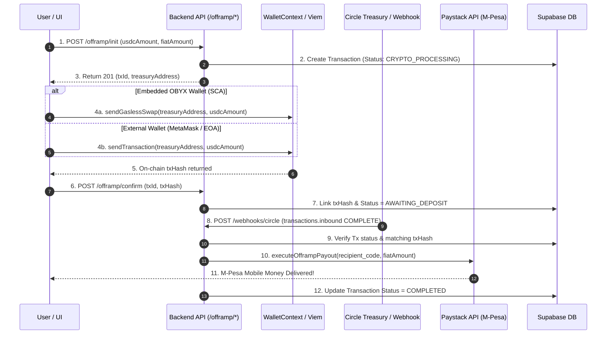

# Architecture Specification 02: End-to-End Offramp Pipeline & Inbound Webhook Payouts

**Document ID**: `ARCH-SPEC-02`  
**Status**: Approved for Engineering Implementation  
**Target Subsystems**: Frontend Swap Widget, Backend Offramp Routes, and Circle Inbound Webhook Routing  
**Primary Objective**: Replace frontend self-sending with authenticated transfers to the Obyx Treasury, expose the Treasury destination address via `/offramp/init`, eliminate hardcoded mock timeouts, and implement automated mobile money payouts via Circle `transactions.inbound` webhooks.

---

## 1. Executive Summary & Architectural Motivation

### 1.1 Problem Statement
The current offramp (USDC $\rightarrow$ KES) implementation contains four critical failure points:
1. **Frontend Self-Sending**: In [SwapWidget.tsx](file:///home/modaniels/Documents/Work/obyx/apps/web/components/home/SwapWidget.tsx#L147), `SwapToCashModal` executes `sendGaslessSwap(circleAddress, usdcAmt)`. The destination is set to the user's *own* address, transferring USDC from themselves to themselves while failing to deposit funds into the Obyx Treasury.
2. **Missing Treasury Destination**: Backend `/offramp/init` initializes a `PENDING` database record but does not return the platform's target `treasuryAddress` to the client.
3. **Hardcoded Mock Payout Delay**: In [offramp.routes.js](file:///home/modaniels/Documents/Work/obyx/apps/api/routes/offramp.routes.js#L210), mobile money payout via Paystack is triggered by a 5-second `setTimeout` mock, completely ignoring whether blockchain deposit confirmation has occurred.
4. **Ignored Inbound Webhooks**: The `/webhooks/circle` handler in [webhook.routes.js](file:///home/modaniels/Documents/Work/obyx/apps/api/routes/webhook.routes.js#L93) filters strictly for `transactions.outbound`, ignoring `transactions.inbound` events emitted when a user deposits USDC into the Treasury.

### 1.2 Target Architecture


---

## 2. Technical Scope & Implementation Roadmap

The implementation is structured into four sequential engineering subsystems.

### Phase 1: Backend Offramp Initialization & Destination Resolution
* [ ] **Task 1.1: Expose Treasury Wallet Address in `/offramp/init`**
  * *Target File*: `apps/api/routes/offramp.routes.js`
  * *Specification*: Inject `process.env.CIRCLE_TREASURY_ADDRESS` (or Circle SDK vault resolution) into the API response payload so clients know where to direct USDC.
* [ ] **Task 1.2: Strict Numeric Bounds & Rate Validation**
  * *Target File*: `apps/api/routes/offramp.routes.js`
  * *Specification*: Add numeric validation on `usdcAmount` and verify exchange rate conversion against system oracle constants.
* [ ] **Task 1.3: Initialize State as `CRYPTO_PROCESSING`**
  * *Target File*: `apps/api/routes/offramp.routes.js`
  * *Specification*: Ensure database record is tagged with the user's active wallet and marked as ready for inbound blockchain deposit.

### Phase 2: Frontend Offramp Destination & Dual-Wallet Fallback
* [ ] **Task 2.1: Replace Self-Sending Destination Address**
  * *Target File*: `apps/web/components/home/SwapWidget.tsx`
  * *Specification*: Extract `treasuryAddress` from `/offramp/init` response and pass it as destination into `sendGaslessSwap()`.
* [ ] **Task 2.2: Implement External EOA Wagmi Fallback**
  * *Target File*: `apps/web/components/home/SwapWidget.tsx`
  * *Specification*: If `activeWallet === "external"`, invoke standard Viem/Wagmi ERC-20 `transfer()` to deposit USDC directly on Base Sepolia.
* [ ] **Task 2.3: Transmit Verified `txHash` to Confirmation Endpoint**
  * *Target File*: `apps/web/components/home/SwapWidget.tsx`
  * *Specification*: Pass the actual blockchain `txHash` returned by Circle Paymaster or Wagmi into `/offramp/confirm`.

### Phase 3: Backend Offramp Confirmation & Timeout Removal
* [ ] **Task 3.1: Eliminate 5-Second Mock `setTimeout` Payout**
  * *Target File*: `apps/api/routes/offramp.routes.js`
  * *Specification*: Remove asynchronous mock timer from `/offramp/confirm`. Update database record with `txHash` and status `AWAITING_DEPOSIT`.
* [ ] **Task 3.2: Create Reusable Payout Execution Helper**
  * *Target File*: `apps/api/services/paystack.service.js`
  * *Specification*: Implement an idempotent helper `executeOfframpPayout(transaction)` that verifies transfer recipient creation and initiates M-Pesa disbursement.

### Phase 4: Circle Inbound Webhook & Automated Payouts
* [ ] **Task 4.1: Extend Webhook for `transactions.inbound`**
  * *Target File*: `apps/api/routes/webhook.routes.js`
  * *Specification*: Add routing in `/webhooks/circle` to intercept `transactions.inbound` updates where `state === 'COMPLETE'`.
* [ ] **Task 4.2: Match Inbound Deposits & Trigger Paystack**
  * *Target File*: `apps/api/routes/webhook.routes.js`
  * *Specification*: Query database for transaction matching `txHash` and destination address, then invoke `executeOfframpPayout()` securely.
* [ ] **Task 4.3: Handle Failed Deposit Webhooks Safely**
  * *Target File*: `apps/api/routes/webhook.routes.js`
  * *Specification*: If inbound transfer reverts on-chain, transition transaction status to `FAILED` and log alert for reconciliation.

---

## 3. Reference Implementation & Exact Code Modifications

### 3.1 `apps/api/routes/offramp.routes.js` (Initialization & Confirmation)
**Engineering Goal**: Return Treasury destination address on init, and remove mock timer on confirm.

```diff
  // POST /offramp/init handler
  router.post('/init', async (req, res) => {
    // ... existing validation & transaction creation ...

    return res.status(201).json({
      success: true,
      data: {
        transactionId: transaction.id,
        cryptoAmount,
        fiatAmount,
        exchangeRate: EXCHANGE_RATE,
        status: transaction.status,
+       treasuryAddress: process.env.CIRCLE_TREASURY_ADDRESS || "0xYourTreasuryWalletAddress",
      },
    });
  });

  // POST /offramp/confirm handler
  router.post('/confirm', async (req, res) => {
    const { transactionId, txHash } = req.body;
    const transaction = await Transaction.findByPk(transactionId);

    if (!transaction) return res.status(404).json({ error: 'Transaction not found' });

-   // REMOVED 5-SECOND MOCK SETTIMEOUT PAYOUT LOGIC
-   setTimeout(async () => { ... }, 5000);

+   // Bind on-chain transaction hash and wait for Circle inbound webhook
+   await transaction.update({
+     txHash: txHash,
+     status: 'AWAITING_DEPOSIT',
+   });
+
+   console.log(`[OFFRAMP] Transaction ${transactionId} awaiting deposit confirmation. txHash: ${txHash}`);
+
+   return res.status(200).json({
+     success: true,
+     message: 'Transaction confirmed on-chain. Awaiting Treasury receipt.',
+     data: { status: 'AWAITING_DEPOSIT' },
+   });
  });
```

---

### 3.2 `apps/web/components/home/SwapWidget.tsx` (Frontend Destination Fix)
**Engineering Goal**: Direct USDC to returned Treasury address and support standard external wallet transfers.

```diff
  // Inside SwapToCashModal handleSwap function
  const res = await OfframpService.postOfframpInit({ usdcAmount: usdcAmt });
+ const treasuryAddr = res.data!.treasuryAddress as string;
+ const txId = res.data!.transactionId;

  let txHashResult = "";

  if (activeWallet === "embedded") {
-   // OLD: const gaslessResult = await sendGaslessSwap(circleAddress, usdcAmt);
+   const gaslessResult = await sendGaslessSwap(treasuryAddr, usdcAmt);
+   txHashResult = gaslessResult.txHash;
  } else {
+   // Fallback for MetaMask / External EOA using Wagmi writeContract
+   txHashResult = await sendStandardErc20Transfer(treasuryAddr, usdcAmt);
  }

+ // Notify backend of blockchain submission
+ await OfframpService.postOfframpConfirm({
+   transactionId: txId,
+   txHash: txHashResult,
+ });
```

---

### 3.3 `apps/api/routes/webhook.routes.js` (Inbound Deposit Handler)
**Engineering Goal**: Listen for Circle Treasury deposit confirmations to execute mobile money payouts.

```diff
  router.post('/circle', async (req, res) => {
    res.status(200).send('OK'); // Acknowledge immediately

    try {
      const event = req.body;
      
      // Existing outbound handler...
      if (event.notificationType === 'transactions.outbound') { ... }

+     // ── Inbound Treasury Deposit Handler ──
+     if (event.notificationType === 'transactions.inbound') {
+       const txId = event.transaction?.id;
+       const state = event.transaction?.state;
+       const txHash = event.transaction?.txHash;
+       const destination = event.transaction?.destinationAddress;
+
+       // Verify deposit landed in Treasury and transaction completed on-chain
+       const treasuryAddr = process.env.CIRCLE_TREASURY_ADDRESS?.toLowerCase();
+       if (state === 'COMPLETE' && destination?.toLowerCase() === treasuryAddr) {
+         const transaction = await Transaction.findOne({
+           where: { txHash: txHash, status: 'AWAITING_DEPOSIT' },
+         });
+
+         if (transaction) {
+           console.log(`[CIRCLE_WEBHOOK] Inbound deposit verified for Tx ${transaction.id}. Executing payout...`);
+           await executeOfframpPayout(transaction);
+         }
+       }
+     }
    } catch (err) {
      console.error('[CIRCLE_WEBHOOK] Error:', err);
    }
  });
```

---

### 3.4 `apps/api/services/paystack.service.js` (Idempotent Payout Helper)
**Engineering Goal**: Provide a clean, reusable method for M-Pesa disbursement.

```diff
+ /**
+  * Executes Paystack mobile money transfer once USDC deposit is verified.
+  */
+ export async function executeOfframpPayout(transaction) {
+   try {
+     const user = await User.findByPk(transaction.userId);
+     if (!user || !user.phoneNumber) throw new Error("User phone number missing");
+
+     // 1. Create Transfer Recipient
+     const recipient = await createTransferRecipient('Obyx User', user.phoneNumber);
+     
+     // 2. Initiate Transfer
+     const transferRes = await initiateTransfer(
+       transaction.fiatAmount,
+       recipient.recipient_code,
+       transaction.id
+     );
+
+     await transaction.update({
+       status: 'COMPLETED',
+       paystackTransferCode: transferRes.data?.transfer_code,
+     });
+     console.log(`[PAYSTACK_PAYOUT] Successfully disbursed ${transaction.fiatAmount} KES for Tx ${transaction.id}`);
+   } catch (error) {
+     console.error(`[PAYSTACK_PAYOUT] Payout failed for Tx ${transaction.id}:`, error);
+     await transaction.update({ status: 'FAILED' });
+   }
+ }
```

---

## 4. Verification & Testing Protocol

Upon completion of the engineering tasks, execute the following validation steps:

1. **Treasury Address Resolution Test**: Invoke `POST /offramp/init` with a valid USDC amount. Verify the HTTP 201 response includes a valid 42-character hex `treasuryAddress` matching `process.env.CIRCLE_TREASURY_ADDRESS`.
2. **Embedded SCA Offramp Test**: Connect via OBYX Wallet (Embedded). Initiate a 5 USDC offramp. Confirm on BaseScan that USDC is transferred from `circleAddress` to `treasuryAddress` (and NOT self-sent).
3. **External EOA Fallback Test**: Connect via MetaMask EOA. Initiate an offramp. Confirm Wagmi prompts for an ERC-20 `transfer()` transaction to `treasuryAddress` and returns a valid transaction hash.
4. **Webhook Payout Simulation Test**: Submit `POST /offramp/confirm` with `txHash`. Verify database state transitions to `AWAITING_DEPOSIT`. Send a simulated Circle webhook payload (`transactions.inbound`, `state: 'COMPLETE'`) with matching `txHash` to `/webhooks/circle`. Verify logs confirm `executeOfframpPayout()` invocation and transaction state updates to `COMPLETED`.
