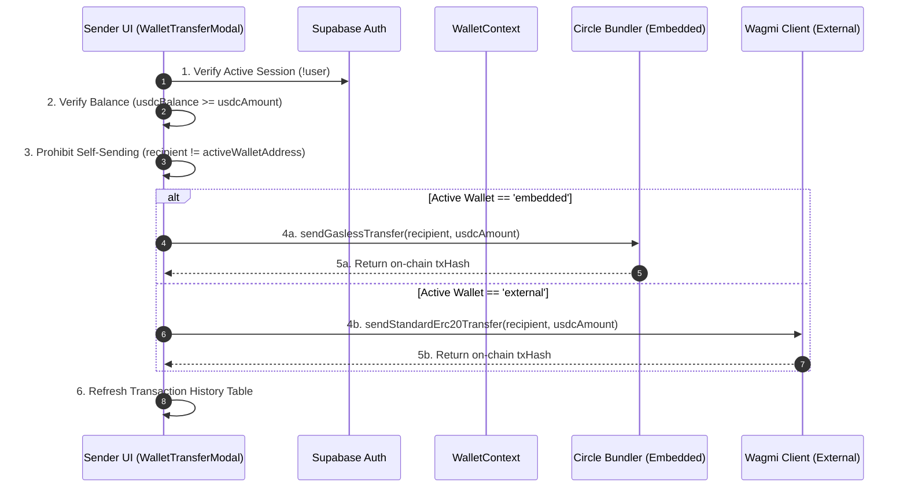

# Architecture Specification 03: Wallet-to-Wallet (P2P) Transfer Engine

**Document ID**: `ARCH-SPEC-03`  
**Status**: Approved for Engineering Implementation  
**Target Subsystems**: Frontend SwapWidget (WalletTransferModal) and WalletContext Engine  
**Primary Objective**: Secure the peer-to-peer Wallet Transfer mechanism by enforcing strict sender authentication, implementing dual-wallet branched execution (Embedded vs External), validating active-wallet liquidity, and prohibiting self-sending.

---

## 1. Executive Summary & Architectural Motivation

### 1.1 Problem Statement
The current Wallet Transfer implementation (`WalletTransferModal`) in `SwapWidget.tsx` lacks fundamental pre-flight financial safeguards:
1. **Unauthenticated Execution**: The UI does not verify if a user holds an active Supabase session before attempting to interact with the blockchain.
2. **Missing External Wallet Support**: Gasless transfers correctly check for the Embedded wallet, but the modal unconditionally fails for External EOAs instead of utilizing standard standard Wagmi ERC-20 transfers.
3. **Missing Balance Gating**: A user can attempt to transfer an amount greater than their active `usdcBalance`, leading to cryptic on-chain failures or bundler simulation rejections.
4. **Self-Send Vulnerability**: The modal does not compare the recipient address against the sender's active address, theoretically allowing users to sponsor gas to send funds to themselves.

### 1.2 Target Architecture


---

## 2. Step-by-Step Implementation Plan

### Phase 1: Sender Authentication & Balance Gating
* [ ] **Task 1.1**: `feat(swap): inject supabase auth verification into wallet transfer modal`
  * *File*: `apps/web/components/home/SwapWidget.tsx`
  * *Action*: Import `useAuth` and prevent modal progression if `!user` is present, redirecting to signup or presenting a strict authentication boundary.
* [ ] **Task 1.2**: `feat(swap): enforce strict active-wallet liquidity verification`
  * *File*: `apps/web/components/home/SwapWidget.tsx`
  * *Action*: Implement numerical `parseFloat(cryptoAmount)` comparison against `usdcBalance` to ensure sufficient funds exist before network invocation.

### Phase 2: Dual-Wallet Routing & Self-Send Prohibitions
* [ ] **Task 2.1**: `feat(swap): implement dual-wallet branched execution engine`
  * *File*: `apps/web/components/home/SwapWidget.tsx`
  * *Action*: Remove the hard stop for external wallets; introduce branched execution routing `embedded` to `sendGaslessTransfer` and `external` to `sendStandardErc20Transfer`.
* [ ] **Task 2.2**: `fix(swap): prohibit recursive self-sending`
  * *File*: `apps/web/components/home/SwapWidget.tsx`
  * *Action*: Implement a case-insensitive check comparing the raw `recipient` address to `activeWalletAddress` to block self-deposits.

### Phase 3: Context Naming & UI Feedback Polish
* [ ] **Task 3.1**: `refactor(wallet): alias sendGaslessSwap to sendGaslessTransfer`
  * *File*: `apps/web/lib/WalletContext.tsx`
  * *Action*: Rename or alias the Circle bundler invocation method to clearly identify it as a P2P transfer operation instead of an exchange swap.
* [ ] **Task 3.2**: `feat(swap): enforce ui locking during blockchain execution`
  * *File*: `apps/web/components/home/SwapWidget.tsx`
  * *Action*: Ensure `isSwapping` disables button interactions globally across the widget while the blockchain awaits confirmation.

---

## 3. Reference Implementation & Code Modifications

### 3.1 `apps/web/lib/WalletContext.tsx` (Context Naming)
**Engineering Goal**: Provide semantic clarity for peer-to-peer transfers.

```diff
  interface WalletContextType {
    // ... existing properties
    sendGaslessSwap: (to: string, usdcAmount: number) => Promise<{ userOpHash: string; txHash: string; }>;
+   sendGaslessTransfer: (to: string, usdcAmount: number) => Promise<{ userOpHash: string; txHash: string; }>;
  }

  // Inside WalletProvider
  const sendGaslessSwap = useCallback(async (to: string, usdcAmount: number) => {
    // ... existing implementation
  }, [primaryWallet]);

+ const sendGaslessTransfer = sendGaslessSwap; // Alias for semantic clarity

  return (
    <WalletContext.Provider value={{
      // ...
      sendGaslessSwap,
+     sendGaslessTransfer,
    }}>
      {children}
    </WalletContext.Provider>
  )
```

---

### 3.2 `apps/web/components/home/SwapWidget.tsx` (WalletTransferModal Enhancements)
**Engineering Goal**: Implement strict sender authentication, balance gating, self-send block, and dual-wallet routing.

```diff
  function WalletTransferModal({ isOpen, onClose }: { isOpen: boolean; onClose: () => void }) {
-   const { sendGaslessSwap, isConnected, activeWallet, activeWalletAddress, circleAddress } = useWallet();
+   const { sendGaslessTransfer, isConnected, activeWallet, activeWalletAddress } = useWallet();
    const { refreshTransactions } = useTransactionHistory();
    const { setShowAuthFlow } = useDynamicContext();
    const { balance: usdcBalance } = useActiveUsdcBalance();
+   const { user } = useAuth();

    // ... state declarations ...

    const handleSend = async () => {
      if (!isConnected) {
        setShowAuthFlow(true);
        return;
      }
+     if (!user) {
+       setError("Authentication required to transfer funds.");
+       return;
+     }
      if (!recipient) {
        setError("Please enter a valid recipient address");
        return;
      }

+     const cleanRecipient = recipient.trim().toLowerCase();
+     if (cleanRecipient === activeWalletAddress?.toLowerCase()) {
+       setError("🚫 You cannot transfer funds to your own active wallet address!");
+       return;
+     }

      try {
        const usdcAmt = parseFloat(cryptoAmount);
        if (!usdcAmt || usdcAmt <= 0) throw new Error("Enter a valid amount");

+       if (usdcBalance < usdcAmt) {
+         throw new Error(`Insufficient balance! You have ${usdcBalance.toFixed(2)} USDC available.`);
+       }

        setIsSwapping(true);
        setError(null);
        let txHashResult = "";

-       // OLD BRANCHING:
-       // if (activeWallet === "external") { setError("Gasless peer-to-peer transfers are currently supported on embedded wallets only."); return; }
-       // if (activeWallet === "embedded" && !circleAddress) return;
-       // const gaslessResult = await sendGaslessSwap(recipient, usdcAmt);

+       // NEW DUAL-WALLET ROUTING:
+       if (activeWallet === "embedded") {
+         const gaslessResult = await sendGaslessTransfer(cleanRecipient, usdcAmt);
+         txHashResult = gaslessResult.txHash;
+       } else if (activeWallet === "external") {
+         txHashResult = await sendStandardErc20Transfer(cleanRecipient, usdcAmt);
+       }

+       setResult({ txHash: txHashResult });
        refreshTransactions();
      } catch (err: any) {
        setError(err.message || "Transfer failed");
      } finally {
        setIsSwapping(false);
      }
    };
```

---

## 4. Verification & Testing Protocol

Upon completion of the engineering tasks, execute the following validation steps:

1. **Authentication Gate Test**: Log out of Supabase. Open the Wallet Transfer modal. Verify clicking "Send USDC" prompts an authentication error or redirects.
2. **Insufficient Balance Test**: Connect a wallet with 0.00 USDC. Enter 50 USDC in the transfer amount field. Verify the transfer is blocked with the message "Insufficient balance! You have 0.00 USDC available."
3. **Self-Send Block Test**: Copy your own active wallet address (`activeWalletAddress`) and paste it into the recipient field. Verify the UI blocks the execution with the message "You cannot transfer funds to your own active wallet address!".
4. **Dual-Wallet Routing Test**: 
   - Connect OBYX Wallet (Embedded). Send 1 USDC to a friend's address. Verify a gasless Circle Paymaster transaction executes.
   - Connect MetaMask (External). Send 1 USDC to a friend's address. Verify Wagmi `writeContract` prompts you to sign a standard ERC-20 transaction and pay network gas.
